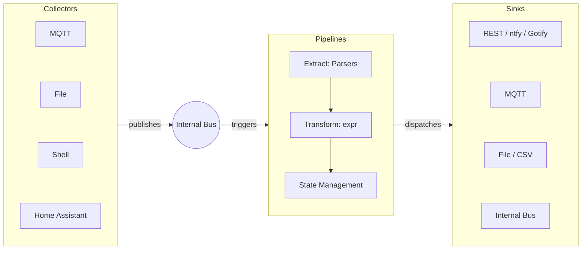

# Siphon

[](https://raw.githack.com/wiki/mekops-labs/siphon/coverage.html)
[](https://goreportcard.com/report/github.com/mekops-labs/siphon)
[](https://pkg.go.dev/github.com/mekops-labs/siphon)


**Project web site:** [mekops.com/projects/siphon](https://mekops.com/projects/siphon/)


This is a program used to gather data from various sources (like MQTT topics) and push the data to different sinks (e.g.
to file, Gotify notification service, IOTPlotter). Dynamically configurable and intended to be deployed as a
containerized service.

## Overview

Siphon uses a decoupled architecture where data collection, routing, and delivery are separated by an internal event bus.



### Key Components

1. Collectors: Ingest data from external sources and publish raw payloads to the internal event bus.
2. Internal Bus: A thread-safe pub/sub system that decouples data ingestion from processing.
3. Pipelines (v2): The core processing logic.
   - Extract: Uses Parsers (JSONPath, Regex) to pull specific values from payloads.
   - Transform: Uses the expr engine to calculate new values or modify existing data.
   - State: Supports Stateful processing to accumulate data over time (e.g., running averages or sums).
   - Triggers: Can be Event-driven (immediate) or Cron-based (scheduled).
4. Sinks: Deliver processed data to external services or back into the internal bus.

## Example configuration

Configuration is in YAML file. Example is in [`configs`](./configs/example.yaml)

### Integrated Editor

Siphon features an integrated, web-based configuration editor powered by ace.js. This allows you to modify your
pipelines, collectors, and sinks directly through a browser with syntax highlighting and validation.

## Home Assistant Integration

Siphon is designed to work seamlessly with Home Assistant.

- Collector: Includes a dedicated `hass` collector to poll entity states.
- Add-on: Siphon is available as a pre-packaged Home Assistant Add-on. See the [siphon-ha-addon](https://github.com/mekops-labs/siphon-ha-addon) repository for
installation instructions.

### Environment variable substitution

Using the `%%ENV_VARIABLE%%` notation it's possible to substitute this entries with environment variables, which may be
useful to use same config in different environments, but with some things that are different (e.g. `HOSTNAME`, some kind
of secrets).

### Support for evaluating expressions

Used in:

- `data.<name>.conv` - to convert variable, e.g. multiply the value by 10 (`val * 10`)
- `dispatchers.sink[].spec` - when `type` is `expr` it can be used for templating, e.g. to generate json (`toJSON(val)`)

Syntax for the evaluation is documented here: [Expr Language Definition](https://expr.medv.io/docs/Language-Definition)

## Deployment

This project uses `ko` as a build system. See the current defaults in the [config file](.ko.yaml).

### Docker containers

By default containers for 32/64 bit arm and 64 x86 architectures are being built. Example deployment using
`docker-compose.yml` may be like in this example:

```yaml
version: '2'

volumes:
  config:

services:
  siphon:
    image: ghcr.io/mekops-labs/siphon:latest
    command:
    - /config/config.yaml
    volumes:
    - config:/config
    restart: always
```

Configuration file (`config.yaml`) needs to be manually copied to the `config` volume in this case. `command` is giving
an argument to the `siphon` application, where to look for it.

## Development

### Adding new modules

Adding additional collectors, parsers, and sinks is pretty much self-contained. Only necessary things is to add the
module code itself and import it in `internal/modules/modules.go`. Take a look at the other modules as an example, like
[file collector](pkg/collector/file/file.go).

## Dependencies

- [jsonpath](https://github.com/PaesslerAG/jsonpath)
- [Paho MQTT](https://github.com/eclipse/paho.mqtt.golang)
- [gocron](https://github.com/go-co-op/gocron)
- [go-yaml](https://github.com/goccy/go-yaml)
- [expr](https://github.com/antonmedv/expr)
- [mapstructure](https://github.com/mitchellh/mapstructure)
